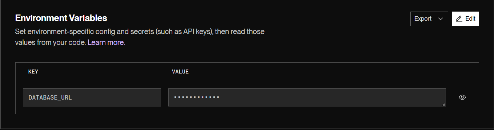
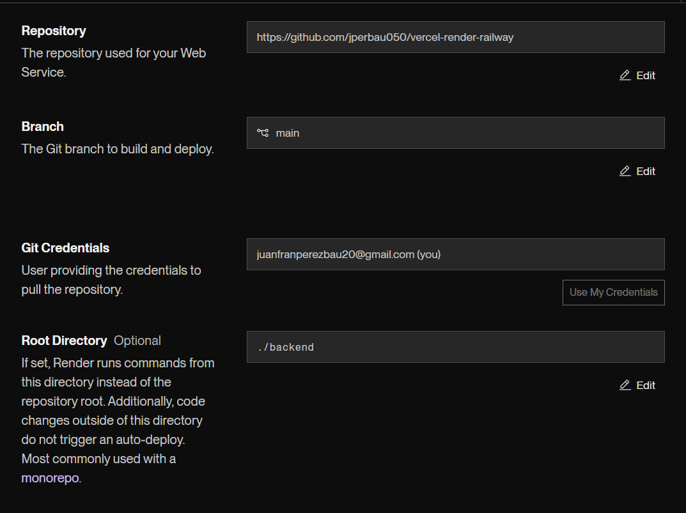
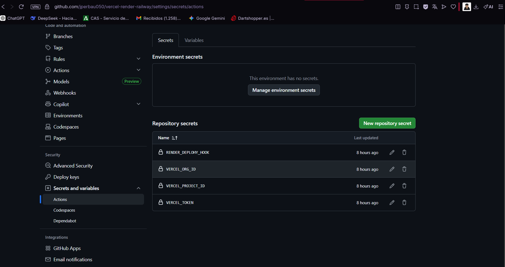
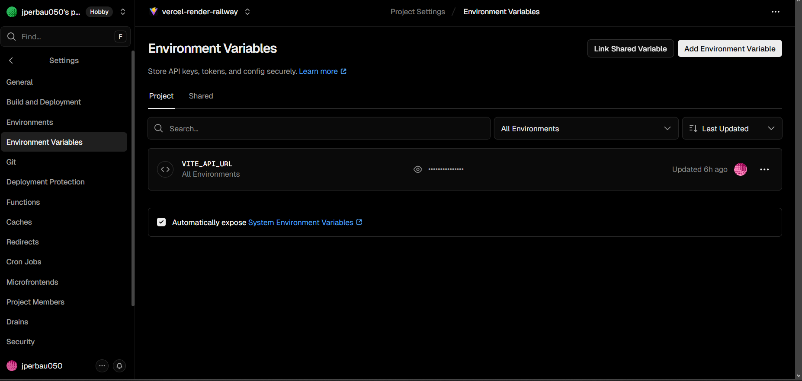
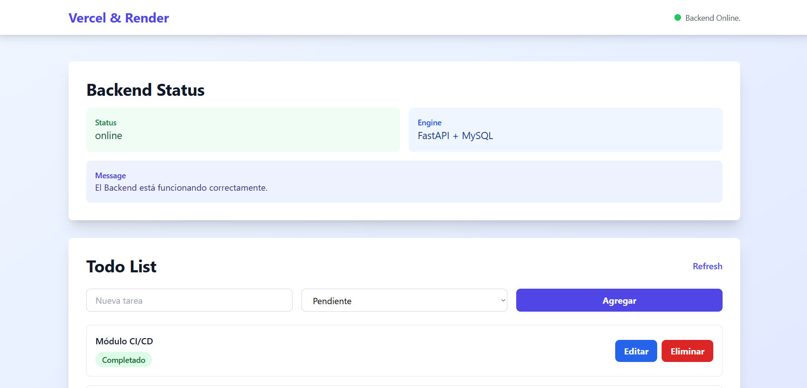

# Entrega de Práctica Final: Despliegue CI/CD

**Nombre:** Juan Francisco Perez Bautista  
**Repositorio GitHub:** [https://github.com/jperbau050/vercel-render-railway.git](https://github.com/jperbau050/vercel-render-railway.git)

---

## Enlaces del Proyecto en Producción

* **Frontend (Vercel):** [https://vercel-render-railway-psi.vercel.app](https://vercel-render-railway-psi.vercel.app)
* **Backend API (Render):** [https://vercel-render-railway.onrender.com/docs](https://vercel-render-railway.onrender.com/docs)
* **Base de Datos:** MySQL alojada en Railway.

---

## Guía de Pasos Realizados

Para llegar al estado actual de la aplicación, se completaron los siguientes hitos técnicos:

1.  **Configuración de Persistencia:** Creación de la instancia de base de datos MySQL en Railway y obtención de las credenciales de acceso público para permitir la conexión externa desde Render.

2.  **Despliegue del Backend:** Configuración del servicio en Render apuntando al directorio raíz `/backend`. Se definió la variable de entorno `DATABASE_URL` utilizando el driver `mysql+pymysql://` para garantizar la compatibilidad con SQLAlchemy y FastAPI.

3.  **Automatización de Despliegues (GitHub Actions):** Sincronización de secretos en el repositorio de GitHub (`RENDER_DEPLOY_HOOK` y `VERCEL_TOKEN`) para habilitar CI/CD.

4.  **Despliegue del Frontend:** Configuración del proyecto en Vercel con el directorio raíz en `/frontend`. Se inyectó la variable de entorno `VITE_API_URL` apuntando a la dirección de producción en Render para permitir la comunicación entre servicios.

5.  **Depuración y Sincronización Final:** Resolución de errores de conexión y problemas de CORS mediante el re-despliegue (Redeploy) forzado del frontend, asegurando que las variables de entorno de Vite se inyectaran correctamente en el cliente durante la compilación.

